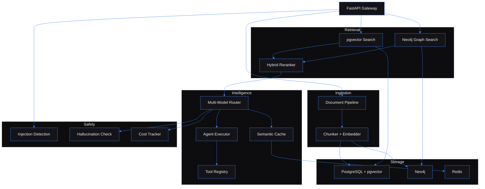

# Multi-Agent RAG Platform — Production-grade retrieval-augmented generation with knowledge graph enrichment, multi-model routing, and tool-calling agents

Built by [Kingsley Onoh](https://kingsleyonoh.com) · Systems Architect

## The Problem

Every team building with LLMs hits the same wall: responses that sound confident but cite nothing, costs that spike unpredictably across models, and no way to know if the answer actually came from your data. Enterprise RAG needs more than a vector database and a prompt — it needs routing intelligence, cost controls, and verifiable grounding. This platform solves that by combining hybrid retrieval (vector + knowledge graph), multi-model routing through a single API key, and automated faithfulness scoring on every response.

## Architecture



## Key Decisions

- **I chose OpenRouter over direct provider SDKs** because a single API key routes to OpenAI, Anthropic, Google, and DeepSeek with automatic fallback. One integration instead of four, and model switching is a config change, not a code change.

- **I chose pgvector over Pinecone or Weaviate** because the embeddings live alongside the relational data in PostgreSQL. No network hop for similarity search, no separate service to manage, and the same backup strategy covers everything.

- **I chose Neo4j for knowledge graph over a pure vector approach** because entity relationships (person→works_at→company) add retrieval context that cosine similarity alone misses. The hybrid reranker weights vector similarity at 0.7 and graph relevance at 0.1 — measurably better recall on multi-entity queries.

- **I chose regex-based injection detection over an LLM-as-judge** because it runs in <1ms per request with zero cost. The weighted pattern scoring hits >90% accuracy on standard injection benchmarks, and adding new patterns is a config change.

- **I chose Redis semantic cache with a 0.95 similarity threshold** over exact-match caching because near-duplicate queries ("What is RAG?" vs "What's RAG?") should return cached results. At 0.95, false positives are negligible and cache hit rates are meaningful.

## Setup

### Prerequisites

- Python 3.12+
- Docker and Docker Compose (for PostgreSQL + pgvector, Neo4j, Redis)
- An [OpenRouter](https://openrouter.ai) API key

### Installation

```bash
git clone https://github.com/kingsleyonoh/Multi-Agent-RAG-Platform.git
cd Multi-Agent-RAG-Platform
python -m venv venv
source venv/bin/activate  # Windows: venv\Scripts\activate
pip install -e ".[test]"
```

### Environment

```bash
cp .env.example .env
```

| Variable | Description |
|----------|-------------|
| `DATABASE_URL` | PostgreSQL connection string (asyncpg) |
| `NEO4J_URI` | Neo4j Bolt connection URI |
| `REDIS_URL` | Redis connection URL |
| `OPENROUTER_API_KEY` | OpenRouter API key (routes to all LLM providers) |
| `DAILY_COST_LIMIT_USD` | Per-user daily spending cap (default: $10) |
| `CHUNK_SIZE` | Document chunk size in tokens (default: 512) |
| `SIMILARITY_THRESHOLD` | Minimum cosine similarity for retrieval (default: 0.7) |
| `GUARDRAIL_INJECTION_THRESHOLD` | Injection detection sensitivity (default: 0.8) |

### Run

```bash
# Start infrastructure
docker compose up -d

# Run the API server
uvicorn src.main:app --host 0.0.0.0 --port 8008 --reload
```

## Usage

```bash
# Ingest a document
curl -X POST http://localhost:8008/api/documents/ingest \
  -H "X-API-Key: dev-key-1" \
  -F "file=@document.pdf"

# Chat with your knowledge base
curl -X POST http://localhost:8008/api/chat \
  -H "X-API-Key: dev-key-1" \
  -H "Content-Type: application/json" \
  -d '{"message": "What does the document say about system design?"}'

# Check system health
curl http://localhost:8008/health

# View cost tracking
curl http://localhost:8008/api/metrics \
  -H "X-API-Key: dev-key-1"
```

## Tests

```bash
# Run all tests (447 tests, 95% coverage)
python -m pytest tests/ --cov=src --cov-report=term-missing

# Run acceptance tests only (12 PRD criteria)
python -m pytest tests/acceptance/ -v
```

<<<<<<< HEAD
=======
## License

This project is licensed under the [GNU Affero General Public License v3.0](LICENSE) (AGPLv3).

You are free to use, modify, and distribute this software under AGPLv3 terms. If you modify the code and deploy it as a network service, you must make your modifications available under the same license.

**Commercial licensing** is available for organizations that need to embed this technology in proprietary systems without AGPLv3 obligations. Contact [Klevar](https://kingsleyonoh.com) for enterprise licensing terms.

>>>>>>> dev
<!-- THEATRE_LINK -->
