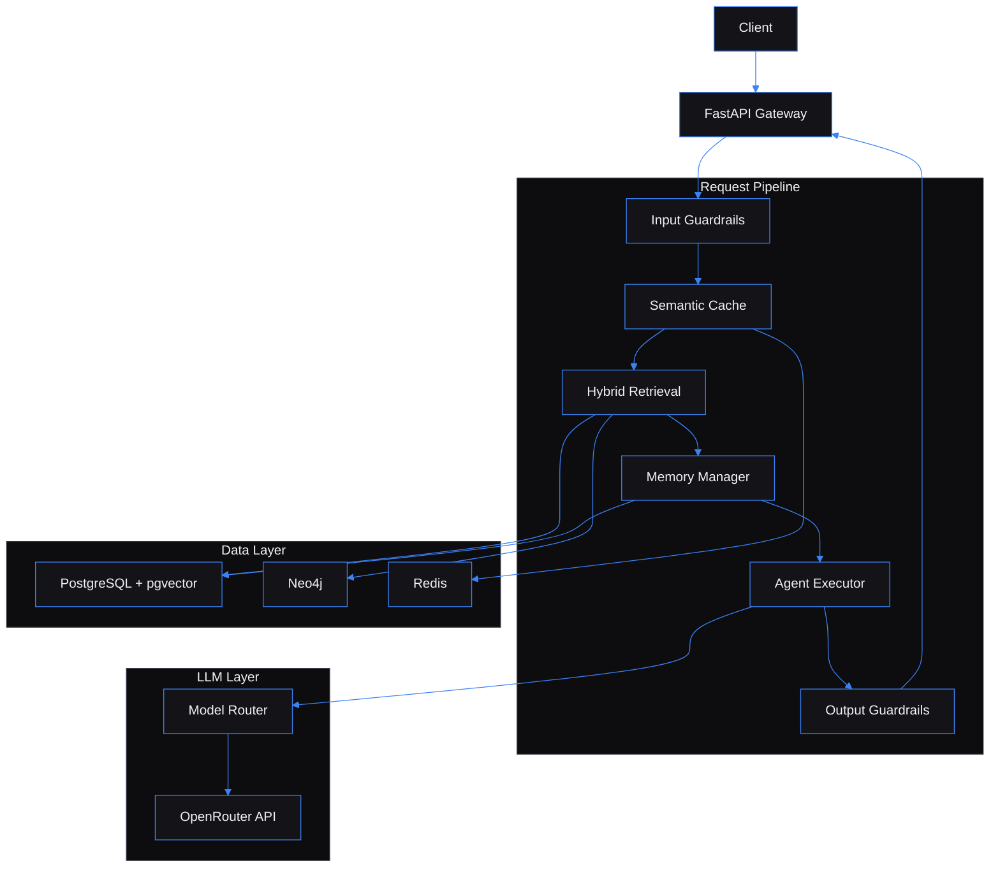

# Multi-Agent RAG Platform — AI backend with hybrid retrieval, multi-model routing, tool-calling agents, and guardrails

Built by [Kingsley Onoh](https://kingsleyonoh.com) · Systems Architect

> **Live:** [https://ai.kingsleyonoh.com](https://ai.kingsleyonoh.com)

## The Problem

Teams building AI-powered products keep solving the same infrastructure problems: retrieval that actually grounds answers in source documents, model routing that balances cost against quality, safety guardrails that run in the pipeline instead of as an afterthought, and cost tracking that prevents a runaway API bill from hitting $500 overnight. This platform is that infrastructure layer — a single API that ingests documents, retrieves context via hybrid search (vector + keyword + knowledge graph), routes to the best model for the task through OpenRouter, executes tool calls when the LLM needs them, and scores every response for faithfulness before it reaches the user.

## Architecture



## Key Decisions

- I chose OpenRouter over direct OpenAI/Anthropic SDKs because a single API key gives access to 200+ models. Switching from GPT-4o to Claude 3.5 Sonnet is a config change, not a code change. The routing table maps task types (chat, summarization, evaluation) to the best model for the job.

- I chose a pure Python ReAct loop over LangGraph because the agent executor handles at most 5 tool calls per turn. A state machine framework adds dependency weight and debugging complexity without proportional value at this scale.

- I chose PostgreSQL + pgvector over a dedicated vector database (Pinecone, Weaviate) because one database handles relational data, vector embeddings, and the semantic cache. No network hop for similarity search, one backup strategy, one fewer service to manage.

- I chose hybrid retrieval (vector + keyword + graph reranking) over vector-only search because embedding similarity misses exact keyword matches and entity relationships. The reranker weights vector at 0.7, keyword at 0.2, and graph at 0.1 — measurably better recall on multi-entity queries.

- I chose to exclude Neo4j from the production Docker Compose on a 1GB VPS because Neo4j's JVM heap would starve the app container. Graph search degrades gracefully to empty results when Neo4j is unavailable — the system works without it, it just works better with it.

## Setup

### Prerequisites

- Python 3.12+
- Docker and Docker Compose (for PostgreSQL 16 + pgvector, Neo4j 5.x, Redis 7)
- An [OpenRouter](https://openrouter.ai) API key

### Installation

```bash
git clone https://github.com/kingsleyonoh/Multi-Agent-RAG-Platform.git
cd Multi-Agent-RAG-Platform
python -m venv venv
source venv/bin/activate  # Windows: venv\Scripts\activate
pip install -e ".[test]"
```

### Environment

```bash
cp .env.example .env
```

| Variable | Description |
|----------|-------------|
| `OPENROUTER_API_KEY` | API key from OpenRouter — routes to all LLM providers |
| `DATABASE_URL` | PostgreSQL + asyncpg connection string |
| `NEO4J_URI` | Neo4j Bolt URI (default: `bolt://localhost:7687`) |
| `NEO4J_USER` / `NEO4J_PASSWORD` | Neo4j credentials |
| `REDIS_URL` | Redis connection URL |
| `API_KEYS` | Comma-separated API keys for client authentication |
| `DAILY_COST_LIMIT_USD` | Per-user daily LLM spending cap (default: `10.00`) |
| `DEFAULT_MODEL` | Default chat model (default: `openai/gpt-4o-mini`) |
| `EMBEDDING_MODEL` | Embedding model (default: `openai/text-embedding-3-small`) |
| `CHUNK_SIZE` | Tokens per document chunk (default: `512`) |
| `SIMILARITY_THRESHOLD` | Minimum cosine similarity for retrieval (default: `0.7`) |
| `CACHE_SIMILARITY_THRESHOLD` | Semantic cache match threshold (default: `0.95`) |
| `GUARDRAIL_INJECTION_THRESHOLD` | Injection detection sensitivity (default: `0.8`) |
| `GUARDRAIL_PII_MODE` | PII handling: `flag`, `block`, or `redact` |
| `DEMO_MODE` | Enable public demo protections — stricter rate limits and cost caps |

### Run

```bash
# Start infrastructure
docker compose up -d

# Run migrations
alembic upgrade head

# Start the API server
uvicorn src.main:app --reload
```

## Usage

All endpoints except `/api/health` require an `X-API-Key` header.

### Check system health

```bash
curl https://ai.kingsleyonoh.com/api/health
```

```json
{
  "status": "healthy",
  "services": {
    "postgresql": "connected",
    "neo4j": "connected",
    "redis": "connected",
    "llm": "reachable"
  }
}
```

### Ingest a document

```bash
curl -X POST https://ai.kingsleyonoh.com/api/documents \
  -H "X-API-Key: your-api-key" \
  -F "file=@report.pdf"
```

```json
{
  "id": "a1b2c3d4-...",
  "title": "report.pdf",
  "source": "upload",
  "status": "embedded",
  "chunk_count": 12,
  "content_hash": "sha256:..."
}
```

### Search the knowledge base

```bash
curl -X POST https://ai.kingsleyonoh.com/api/search \
  -H "X-API-Key: your-api-key" \
  -H "Content-Type: application/json" \
  -d '{"query": "What is retrieval-augmented generation?", "top_k": 5}'
```

```json
{
  "results": [
    {
      "chunk_id": "...",
      "document_id": "...",
      "content": "RAG combines retrieval with generation...",
      "score": 0.89,
      "document_title": "report.pdf",
      "document_source": "upload"
    }
  ],
  "query": "What is retrieval-augmented generation?",
  "total": 5
}
```

### Chat with RAG context

```bash
curl -X POST https://ai.kingsleyonoh.com/api/chat/sync \
  -H "X-API-Key: your-api-key" \
  -H "Content-Type: application/json" \
  -d '{"query": "What does the document say about system design?"}'
```

```json
{
  "response": "Based on the retrieved context, the document describes...",
  "sources": [
    {"document_title": "report.pdf", "content": "...", "score": 0.91}
  ],
  "model_used": "openai/gpt-4o-mini",
  "cost": 0.0003,
  "conversation_id": null
}
```

### Stream a response (SSE)

```bash
curl -N -X POST https://ai.kingsleyonoh.com/api/chat \
  -H "X-API-Key: your-api-key" \
  -H "Content-Type: application/json" \
  -d '{"query": "Explain the architecture", "model": "openai/gpt-4o"}'
```

## Tests

```bash
python -m pytest
```

## Deployment

This project runs on a DigitalOcean VPS behind Traefik with automatic image pulls via Watchtower.

### Production Stack

| Component | Role |
|-----------|------|
| `ghcr.io/kingsleyonoh/multi-agent-rag` | FastAPI application container |
| `pgvector/pgvector:pg16` | PostgreSQL 16 with vector search |
| `redis:7-alpine` | Semantic cache and rate limiting |
| Traefik | Reverse proxy with automatic TLS |

Neo4j is excluded from the production compose due to 1GB VPS RAM constraints. Graph search returns empty results gracefully — hybrid retrieval falls back to vector + keyword scoring.

### Self-Host

```bash
# Pull the image
docker pull ghcr.io/kingsleyonoh/multi-agent-rag:latest

# Or use the compose file
docker compose -f docker-compose.prod.yml up -d
```

Set the environment variables listed in **Setup > Environment** before starting.

## License

This project is licensed under the [GNU Affero General Public License v3.0](LICENSE) (AGPLv3).

You are free to use, modify, and distribute this software under AGPLv3 terms. If you modify the code and deploy it as a network service, you must make your modifications available under the same license.

**Commercial licensing** is available for organizations that need to embed this technology in proprietary systems without AGPLv3 obligations. Contact [Klevar](https://kingsleyonoh.com) for enterprise licensing terms.

---

Full case study, architectural breakdown, and engineering deep-dive at [kingsleyonoh.com/projects/multi-agent-rag-platform](https://www.kingsleyonoh.com/projects/multi-agent-rag-platform)
